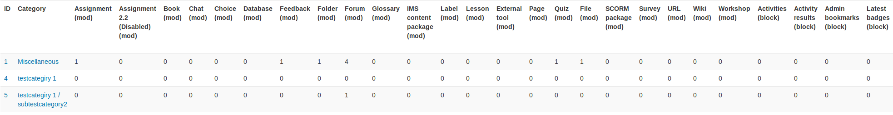
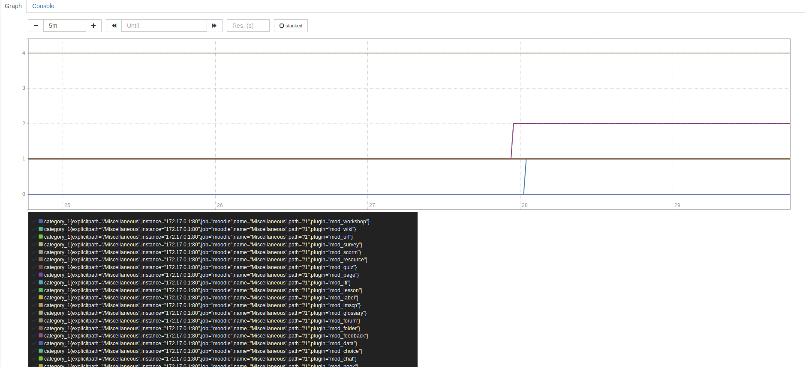

# moodle-report_elearning

This report shows how often each course category uses each plugin.

## Features
There are two main features: the moodle-native report and the prometheus endpoint.
    
The E-learning report can be found under Dashboard -> Site administration -> Reports -> E-Learning
Here is a sample output of the report:

    
The prometheus-endpoint is supplied as a moodle-web-service. Pointed at it, prometheus will scrape the data.
The data should look something like this:

Or like this in Graph view:


## Installation

Go into your moodle/report repository.
Clone this project into a new folder called elearning: `git clone https://github.com/rtschu/moodle-report_elearning.git elearning`
    
Go to moodle, login as admin and update the database.
    
## Prometheus

1. Log into moodle and navigate to Site administration -> Plugin -> Web services
2. Enable web services
3. Create a new user for the web service with the sufficient permissions. Or use an existing one with enough permissions.
4. Create a new token for this user for the `elearning_prometheus` Service.
5. Go to the bottom of the Web services page and copy the created Token.
6. For this to work you'll need to have a webservice protocol that puts out raw data. There is currently no such protocol available by default. You can skip the following substeps, if you already have such a protocol.
    1. Clone the raw protocol. Go to your moodle repository and enter `git clone https://github.com/rtschu/moodle-raw-protocol.git webservice/raw`
    2. Go back to the Web service panel and enable the RAW protocol under Manage protocols.
7. Install prometheus
8. Add this to your prometheus.yml scrape_configs
    ```yml 
        - job_name: 'moodle'
        scrape_interval: 5s
        metrics_path: /moodle/webservice/raw/server.php
        params:
            wstoken: ['TOKEN']
            wsfunction: ['report_elearning_prometheus_endpoint']
            moodlewsrestformat: ['raw']
        static_configs:
          - targets: ['172.17.0.1']
    ```      
9. Add the Token.